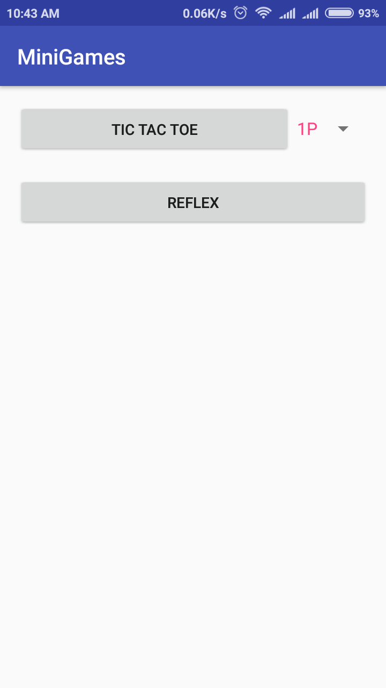

# MiniGames
An android application which contains list of mini games.

1. Tic Tac Toe supports 1 player(using minimax algorithm to make game hardest) and two player modes over different phones(***Bluetooth***) and same phone.
	Also support easy 1p mode with different responses.
2. Reflex based game to test hand eye co ordination. Scoring system for tracking progress.

For more screenshots, browse gameplay folder.

